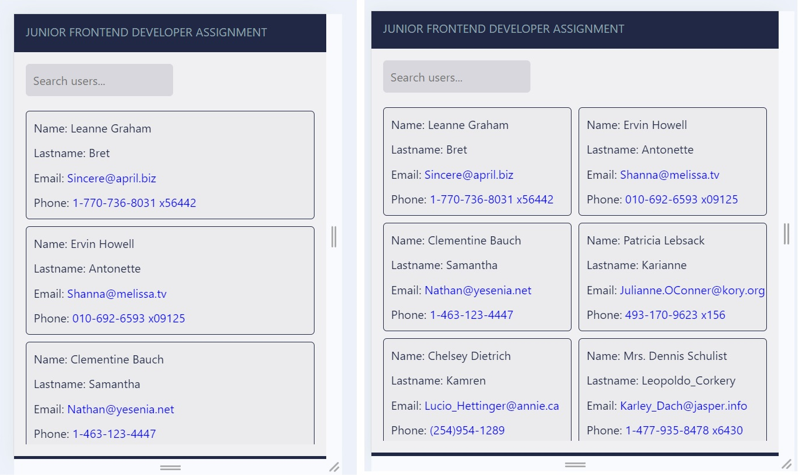
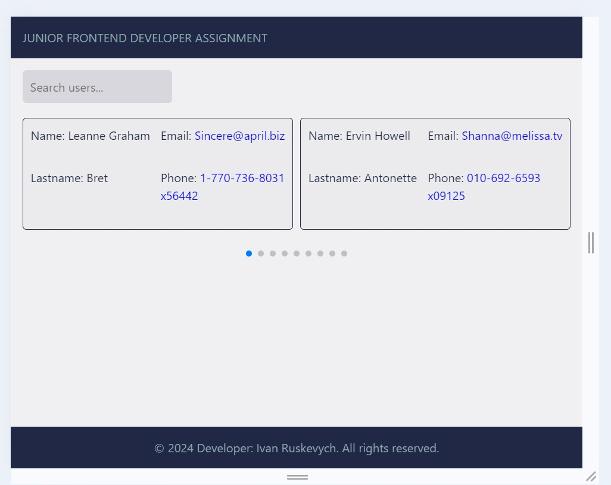
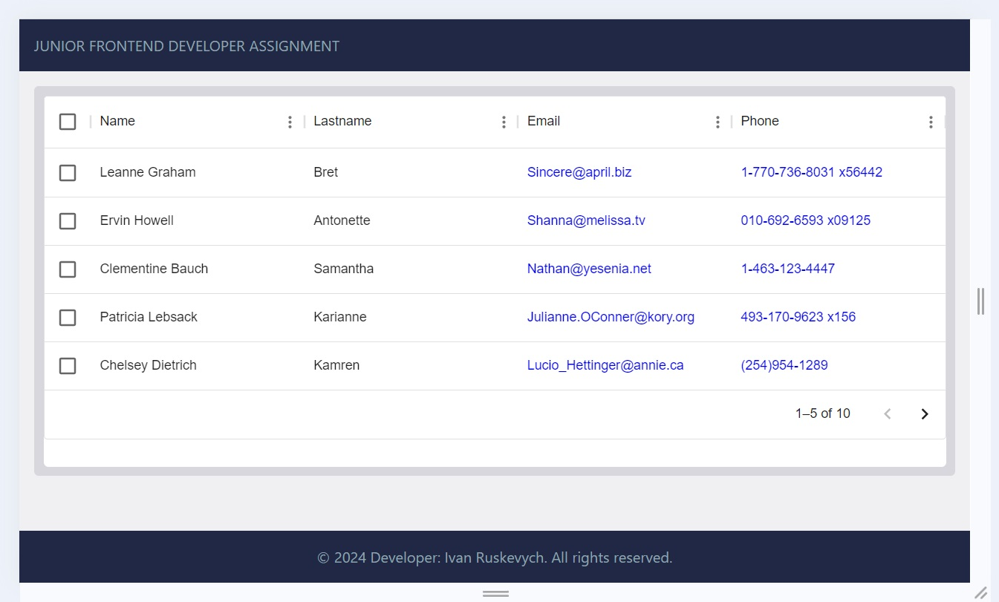
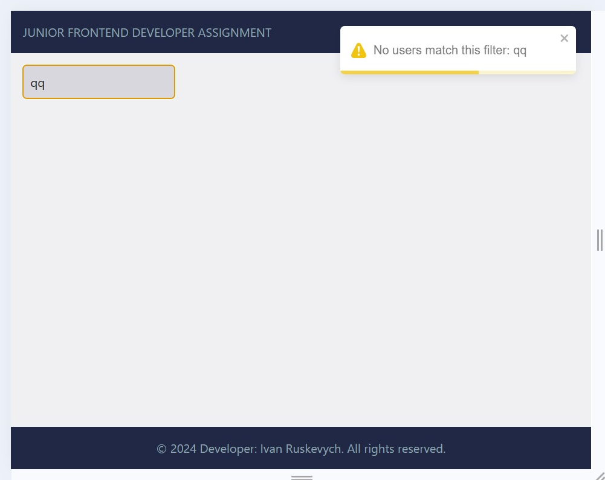

# Smart App
This application ensures an intuitive user experience across various platforms while providing robust functionality for managing user data efficiently.

## Description
This application provides a responsive and dynamic interface for managing user information. 
It includes the following key features:
 - User Information Display: The app displays essential user details, including name, username, email, and phone number in a structured format.
 - Advanced Filtering: An integrated search feature allows users to filter the table by name, username, email, and phone, making it easy to find specific records quickly.
 - Responsive Design: The application adapts to different devices with tailored behaviors:
   - Desktop: Displays user data in a traditional table format for a comprehensive view.
   - Tablet: Transforms the data into a slider format for easier navigation on medium-sized screens.
   - Mobile: Presents the information in a list format for optimal viewing on smaller devices.






 
### Using the Application:
1. Use the [link](https://ivanruskevych.github.io/smart-app/) to start using the application

### Steps to Run the Application:
1. Clone the repository: `git clone https://github.com/IvanRuskevych/smart-app.git` & `cd smart-app`

2. Install dependencies: `npm install`

3. Start in development mode: `npm run dev`

4. Open a web browser and go to: `http://localhost:5173/smart-app/`


# React + TypeScript + Vite

This template provides a minimal setup to get React working in Vite with HMR and some ESLint rules.

Currently, two official plugins are available:

- [@vitejs/plugin-react](https://github.com/vitejs/vite-plugin-react/blob/main/packages/plugin-react/README.md) uses [Babel](https://babeljs.io/) for Fast Refresh
- [@vitejs/plugin-react-swc](https://github.com/vitejs/vite-plugin-react-swc) uses [SWC](https://swc.rs/) for Fast Refresh

## Expanding the ESLint configuration

If you are developing a production application, we recommend updating the configuration to enable type aware lint rules:

- Configure the top-level `parserOptions` property like this:

```js
export default tseslint.config({
  languageOptions: {
    // other options...
    parserOptions: {
      project: ['./tsconfig.node.json', './tsconfig.app.json'],
      tsconfigRootDir: import.meta.dirname,
    },
  },
})
```

- Replace `tseslint.configs.recommended` to `tseslint.configs.recommendedTypeChecked` or `tseslint.configs.strictTypeChecked`
- Optionally add `...tseslint.configs.stylisticTypeChecked`
- Install [eslint-plugin-react](https://github.com/jsx-eslint/eslint-plugin-react) and update the config:

```js
// eslint.config.js
import react from 'eslint-plugin-react'

export default tseslint.config({
  // Set the react version
  settings: { react: { version: '18.3' } },
  plugins: {
    // Add the react plugin
    react,
  },
  rules: {
    // other rules...
    // Enable its recommended rules
    ...react.configs.recommended.rules,
    ...react.configs['jsx-runtime'].rules,
  },
})
```
